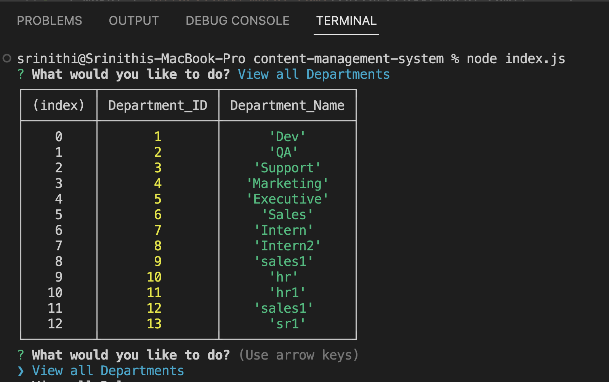

# content-management-system

## Description

This application uses  command line interface that manages the employee info. It has options to "View all Departments", "View all Roles", "View all Employees", "Add a department",  "Add a role",  "Add an employee", "Update an employee role". Add/Update option will prompt user with questions to add employee detail. It is built using node.js and MySql DB.

## Technology Used

| Nodejs | [https://nodejs.org/docs/latest-v16.x/api/](https://nodejs.org/docs/latest-v16.x/api/)     |  
| Inquirer | [https://www.npmjs.com/package/inquirer/v/8.2.4#question](https://www.npmjs.com/package/inquirer/v/8.2.4#question)     |  
| mySql | [https://www.mysql.com/](https://www.mysql.com/)     | 

## Usage

All the database/table creation are stored in schema.sql file and initial values are in seeds.sql file. It uses primary key/ foreign key and other constraints for the table fields.
This app manages the employee content stored in the DB. Upon running "node index.js", user will be prompted with options to view/add dept/role/employee. All the content are stored/retrieved from the mysql db.

Below is the list of questions inputted by user.

## Demo

Walkthrough video of using this app is in the following link

Google drive link - (https://drive.google.com/file/d/1cNLrEnPP94VagN7QiGjgJHmrl2nhdXAC/view)

## Learning points

* using node.js with mysql DB

## Links

Github Repo - https://github.com/srinithi19/content-management-system  
Application URL - https://srinithi19.github.io/content-management-system/

